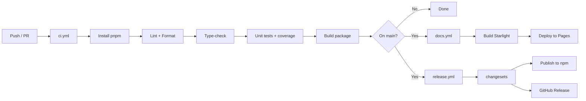
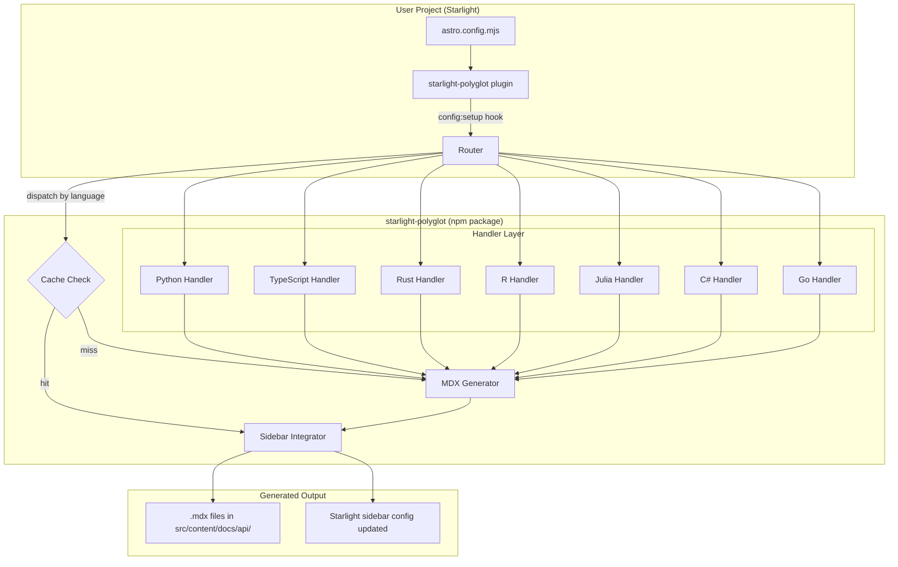
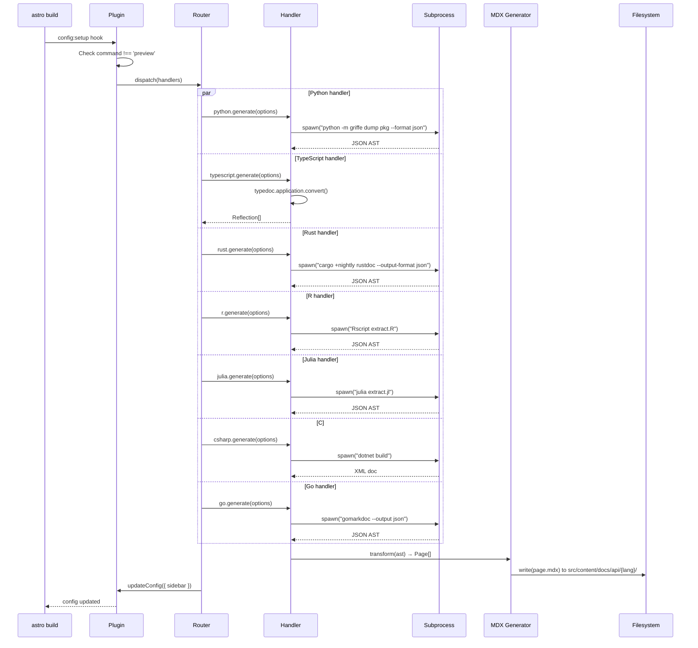
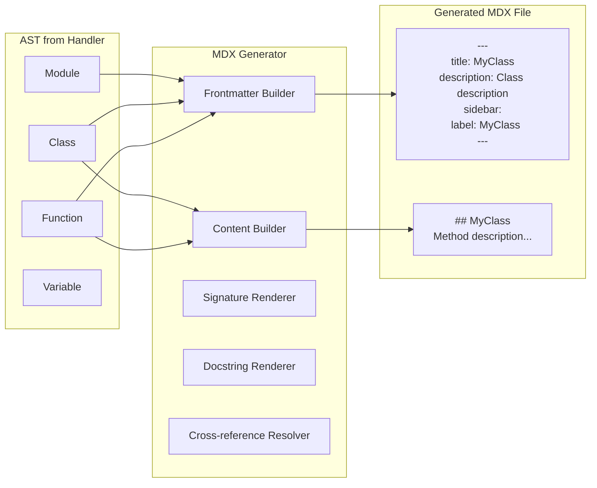
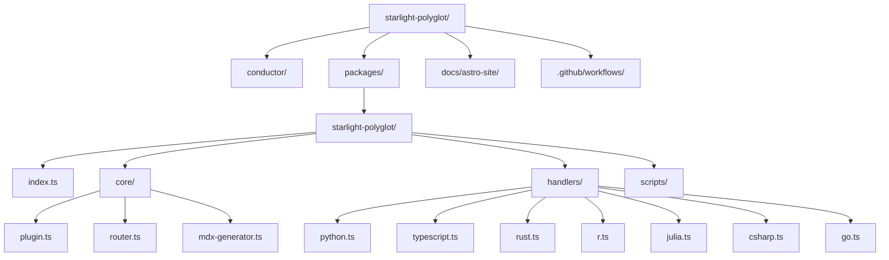
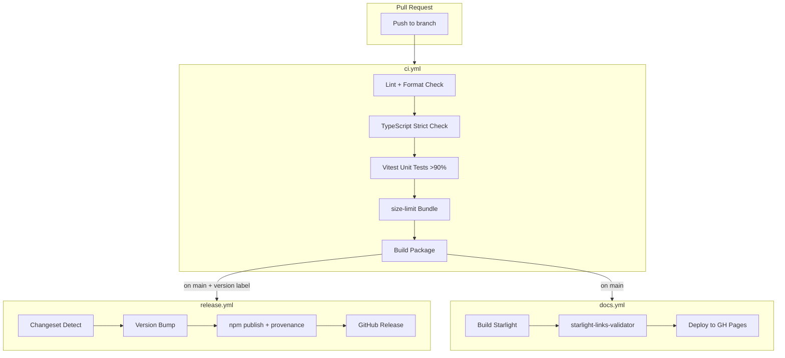
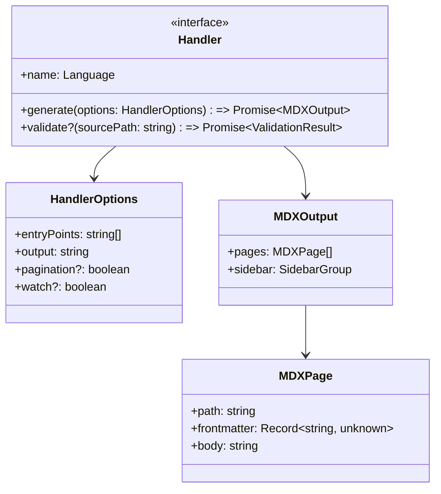
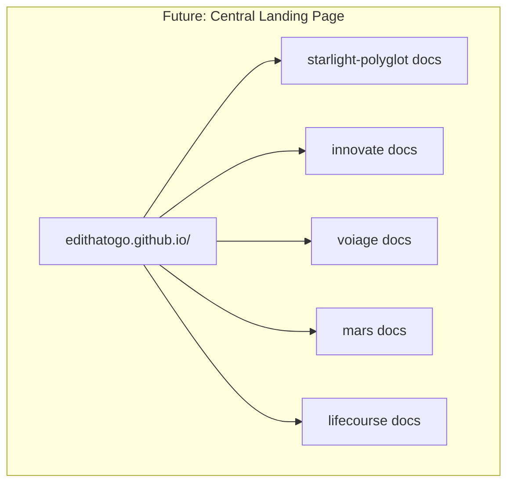

# Design Architecture

## System Overview (DGN-ARCH-001)

```mermaid
flowchart TB
    subgraph User["User Project"]
        A[astro.config.mjs] -->|polyglot({...})| B[Starlight Plugin]
        B --> C[Router Dispatch]
    end

    subgraph Core["starlight-polyglot Core"]
        C -->|python| D1[Python Handler]
        C -->|typescript| D2[TypeScript Handler]
        C -->|rust| D3[Rust Handler]
        C -->|r| D4[R Handler]
        C -->|julia| D5[Julia Handler]
        C -->|csharp| D6[C# Handler]
        C -->|go| D7[Go Handler]
        D1 -->|spawn griffe| E1[Python MDX]
        D2 -->|import TypeDoc| E2[TypeScript MDX]
        D3 -->|spawn rustdoc| E3[Rust MDX]
        D4 -->|spawn Rscript| E4[R MDX]
        D5 -->|spawn julia| E5[Julia MDX]
        D6 -->|spawn dotnet| E6[C# MDX]
        D7 -->|spawn gomarkdoc| E7[Go MDX]
        E1 & E2 & E3 & E4 & E5 & E6 & E7 --> F[MDX Generator]
        F -->|write files| G[src/content/docs/api/]
    end

    G --> H[Starlight Build]
    H --> I[Static HTML Site]
```

## Handler Lifecycle (DGN-HDL-001)

```mermaid
sequenceDiagram
    participant S as Starlight build
    participant P as starlight-polyglot
    participant H as Handler
    participant T as Language Toolchain

## Plugin Architecture (DGN-PLUGIN-001)

```mermaid
classDiagram
    class StarlightPolyglotPlugin {
        +name: string
        +hooks: object
        +config:setup(event) void
    }
    class PluginConfiguration {
        +handlers: Record~Language, HandlerOptions~
        +cache: boolean
        +watch: boolean
        +timeout: number
    }
    class Router {
        -handlers: Map~Language, Handler~
        +register(language, handler) void
        +dispatch(language, options) Promise~MDXOutput[]~
        +enabled(): Language[]
    }
    class Handler {
        <<interface>>
        +name: Language
        +generate(options) Promise~MDXOutput[]~
        +validate?(source) Promise~ValidationResult~
    }
    class MDXOutput {
        +content: string
        +frontmatter: Frontmatter
        +outputPath: string
    }
    class CacheLayer {
        +get(key): MDXOutput[] | null
        +set(key, value): void
        +invalidate(key): void
    }
    class SidebarIntegration {
        +insertInto(config, pages): SidebarConfig
    }

    StarlightPolyglotPlugin --> PluginConfiguration
    StarlightPolyglotPlugin --> Router
    StarlightPolyglotPlugin --> CacheLayer
    StarlightPolyglotPlugin --> SidebarIntegration
    Router --> Handler
    Handler --> MDXOutput
```

## CI/CD Pipeline (DGN-CICD-001)



## Language Handler Template (DGN-HANDLER-001)

```mermaid
flowchart TB
    subgraph Handler["Any Language Handler (~20 lines)"]
        A[Receive HandlerOptions] --> B[Build command + args]
        B --> C[Spawn subprocess]
        C --> D[Parse JSON stdout]
        D --> E[Transform to MDXOutput[]]
        E --> F[Return to core]
    end
```

## Design Cross-Reference

| Design Node | Description | Linked Requirements |
|-------------|-------------|-------------------|
| DGN-ARCH-001 | System overview | REQ-CORE-001, REQ-CORE-002, REQ-CORE-003 |
| DGN-HDL-001 | Handler lifecycle | REQ-CORE-004, REQ-CORE-009, REQ-CORE-010, REQ-CORE-011 |
| DGN-PLUGIN-001 | Plugin class architecture | REQ-CORE-006, REQ-MIG-001 |
| DGN-CICD-001 | CI/CD pipeline | REQ-CI-001 through REQ-CI-006 |
| DGN-HANDLER-001 | Language handler template | REQ-HDL-001, REQ-HDL-002, REQ-HDL-003 |

    S->>P: config:setup hook
    P->>P: Check cache
    alt Cache hit
        P->>S: Skip generation
    else Cache miss
        P->>H: dispatch(language, options)
        H->>T: spawn(tool)
        T-->>H: JSON output
        H->>H: transform to MDX
        H-->>P: MDXOutput[]
        P->>P: write files to content dir
        P->>P: update sidebar config
        P->>S: updated Starlight config
    end
    S->>S: build content + Starlight pages
    S->>S: deploy static HTML
```
# Design Architecture

## 1. Plugin Architecture Overview (DGN-CORE-001)



## 2. Handler Dispatch Flow (DGN-CORE-002)



## 3. MDX Generator Internal (DGN-MDX-001)



## 4. Package Structure (DGN-REPO-001)



## 5. CI/CD Pipeline (DGN-CI-001)



## 6. Handler Interface Contract (DGN-CONTRACT-001)



## 7. Future Central Landing Page (DGN-LATER-001)



## Cross-Reference Index

| Diagram Node | Description | Related REQ ID | Related TRK |
|-------------|-------------|---------------|-------------|
| DGN-CORE-001 | Plugin Architecture | REQ-CORE-001..006 | TRK-core_router_plugin |
| DGN-CORE-002 | Handler Dispatch Flow | REQ-CORE-003 | TRK-core_router_plugin, TRK-handler_* |
| DGN-MDX-001 | MDX Generator Internal | REQ-CORE-004,005 | TRK-core_mdx_generator |
| DGN-REPO-001 | Package Structure | REQ-CORE-001 | TRK-plugin_scaffold |
| DGN-CI-001 | CI/CD Pipeline | REQ-CI-001..007 | TRK-ci_cd |
| DGN-CONTRACT-001 | Handler Interface | REQ-HDL-001,002,003 | TRK-tests |
| DGN-LATER-001 | Central Landing Page | — | Future |
```