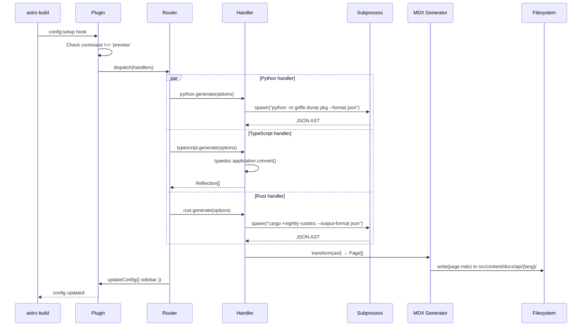

This page describes the architecture of starlight-polyglot, covering the plugin system, handler dispatch, MDX generation pipeline, and package structure.

## System Overview

```mermaid
flowchart TB
    subgraph User["User Project"]
        A[astro.config.mjs] -->|polyglot({...})| B[Starlight Plugin]
        B --> C[Router Dispatch]
    end

    subgraph Core["starlight-polyglot Core"]
        C -->|python| D1[Python Handler]
        C -->|typescript| D2[TypeScript Handler]
        C -->|rust| D3[Rust Handler]
        C -->|r| D4[R Handler]
        C -->|julia| D5[Julia Handler]
        C -->|csharp| D6[C# Handler]
        C -->|go| D7[Go Handler]
        D1 -->|spawn griffe| E1[Python MDX]
        D2 -->|import TypeDoc| E2[TypeScript MDX]
        D3 -->|spawn rustdoc| E3[Rust MDX]
        D4 -->|spawn Rscript| E4[R MDX]
        D5 -->|spawn julia| E5[Julia MDX]
        D6 -->|spawn dotnet| E6[C# MDX]
        D7 -->|spawn gomarkdoc| E7[Go MDX]
        E1 & E2 & E3 & E4 & E5 & E6 & E7 --> F[MDX Generator]
        F -->|write files| G[src/content/docs/api/]
    end

    G --> H[Starlight Build]
    H --> I[Static HTML Site]
```

## Core Components

### Plugin Entry (`index.ts`)

The main entry point exports two APIs:

- **`polyglot(options)`** — Standard Starlight plugin function. The primary API for most users.
- **`createPolyglotPlugin()`** — Factory returning `[plugin, sidebarGroup]` tuple. Use when the sidebar group must be referenced by other plugins.

Both use the `config:setup` hook to:

1. Skip generation during `preview` command (files already on disk)
2. Resolve user config to handler instances via `resolveHandlers()`
3. Execute each handler's `generate()` method in sequence
4. Merge generated sidebar entries into the Starlight sidebar config

### Router (`core/router.ts`)

The router resolves user configuration into handler instances:

- Maps language strings to handler modules via `getHandlerMap()`
- Handlers are lazy-loaded (dynamic imports) to avoid loading unnecessary deps
- Validates that each configured language has a registered handler
- Sets default `output` path (`api/{language}`) if not specified

### Handler Interface (`core/handler.ts`)

Every language handler implements this contract:

- **`name`**: Language identifier from the `Language` union type
- **`generate(options)`**: Main method — extracts docs and returns MDX pages
- **`validate?(sourcePath)`**: Optional pre-flight check for toolchain availability


### MDX Generator (`core/mdx-generator.ts`)

The shared output pipeline used by all handlers:

1. Accepts `ASTModule[]` — module, class, function, variable definitions
2. Generates Starlight-native MDX with proper frontmatter (`title`, `description`, `sidebar`, `pagefind`, `language`, `source`)
3. Creates individual pages for each module, class, and function
4. Generates a sidebar group structure for Starlight navigation
5. Writes files via `writeMDXPages()` to the Starlight content directory

## Handler Dispatch Flow



## Package Structure

```
starlight-polyglot/
├── conductor/                   # Design docs & requirements
├── docs/
│   └── astro-site/              # Self-hosted Starlight docs (this site)
├── packages/
│   └── starlight-polyglot/      # Main plugin package
│       ├── index.ts             # Plugin entry point
│       ├── core/
│       │   ├── handler.ts       # Handler interface types
│       │   ├── plugin.ts        # Plugin setup & sidebar management
│       │   ├── router.ts        # Handler resolution & config
│       │   └── mdx-generator.ts # Shared MDX output pipeline
│       ├── handlers/            # Language handler implementations
│       │   ├── python.ts
│       │   ├── typescript.ts
│       │   ├── rust.ts
│       │   ├── r.ts
│       │   ├── julia.ts
│       │   ├── csharp.ts
│       │   └── go.ts
│       └── scripts/             # Language-specific extractor scripts
│           └── python_extract.py
├── package.json
└── pnpm-workspace.yaml
```

## Design Decisions

### Why Subprocess Isolation?

Each non-JS handler spawns the language's toolchain in a subprocess rather than embedding it:

- **Independence**: Python/Rust/Go toolchains don't pollute the Node.js process
- **Simplicity**: Handlers are thin wrappers around existing CLI tools
- **Debuggability**: Toolchain errors are captured and reported independently
- **Security**: Subprocess boundaries prevent toolchain failures from crashing the build

### Why Dynamic Imports for Handlers?

Handlers use `lazyHandler()` which dynamically imports at generation time:

- Users who only need Python docs don't pay the cost of loading TypeDoc
- Optional peer dependencies (like `typedoc`) are only imported when needed
- Individual handlers can be updated without affecting the core

### Why the Shared MDX Pipeline?

All handlers produce `ASTModule[]` for the shared `transformToMDX()` pipeline:

- **Consistent frontmatter**: Every page has the same metadata structure
- **Uniform sidebar**: All language docs get the same sidebar treatment
- **Reusable test strategies**: The pipeline can be tested independently
- **Pluggable output**: Future formats (JSON, RSS, LLM) added in one place

## Cross-Reference

| Diagram Node             | Description                              | Related Requirements |
|--------------------------|------------------------------------------|----------------------|
| DGN-CORE-001             | Plugin Architecture Overview             | REQ-CORE-001..006    |
| DGN-CORE-002             | Handler Dispatch Flow                    | REQ-CORE-003         |
| DGN-MDX-001              | MDX Generator Internal                   | REQ-CORE-004, 005    |
| DGN-REPO-001             | Package Structure                        | REQ-CORE-001         |
| DGN-CI-001               | CI/CD Pipeline                           | REQ-CI-001..007      |
| DGN-CONTRACT-001         | Handler Interface Contract               | REQ-HDL-001, 002,003 |
