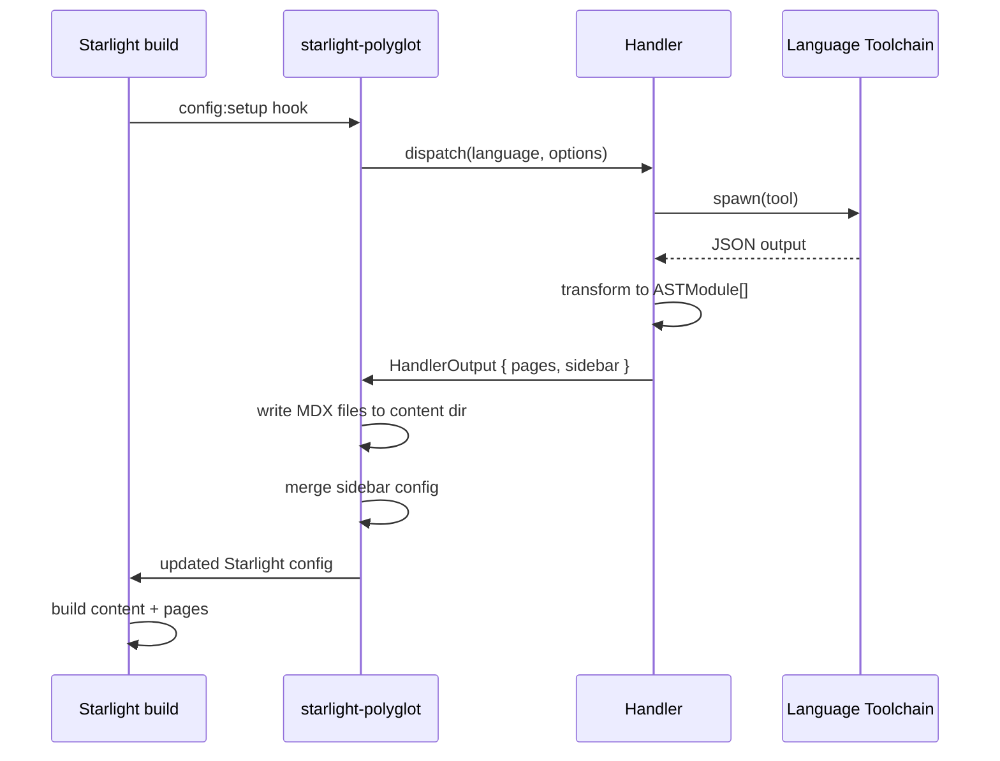

This guide covers how to create a new language handler for starlight-polyglot. Handlers are the plugin's extension mechanism — each one encapsulates the logic for extracting API documentation from a specific programming language's source code.

## The Handler Interface

Every handler must implement the `Handler` interface defined in `core/handler.ts`:

```typescript
interface Handler {
  /** Language identifier matching the Language union type */
  name: Language;

  /**
   * Generate MDX documentation pages from source code.
   * @param options - Handler-specific configuration and output settings
   * @returns An array of MDXOutput pages ready for writing to disk
   */
  generate(options: HandlerOptions): Promise<MDXOutput[]>;

  /**
   * Optional pre-flight validation to check that the handler's
   * runtime environment is available.
   * @param sourcePath - Path to the source code or project root
   * @returns Validation result indicating any issues
   */
  validate?(sourcePath: string): Promise<ValidationResult>;
}
```

### HandlerOptions

```typescript
interface HandlerOptions {
  output: string;           // Output subdirectory under src/content/docs/
  pagination?: boolean;     // Include pagination links between pages
  watch?: boolean;          // Watch source files for changes
  [key: string]: unknown;   // Language-specific options
}
```

### MDXOutput

```typescript
interface MDXOutput {
  content: string;                // Raw MDX (frontmatter + body)
  frontmatter: Record<string, unknown>;  // Parsed frontmatter
  outputPath: string;             // Relative path, e.g. "api/python/io.mdx"
}
```

## The Shared AST Schema

Most handlers use `transformToMDX()` from `core/mdx-generator.ts`. This ensures consistent output, sidebar generation, and frontmatter across all languages.

```typescript
interface ASTModule {
  name: string;
  docstring?: string;
  classes?: ASTClass[];
  functions?: ASTFunction[];
  variables?: ASTVariable[];
}

interface ASTClass {
  name: string;
  docstring?: string;
  methods?: ASTFunction[];
  properties?: ASTVariable[];
}

interface ASTFunction {
  name: string;
  signature?: string;
  docstring?: string;
  parameters?: ASTParameter[];
  return_type?: string;
}

interface ASTParameter {
  name: string;
  type?: string;
  description?: string;
  default?: string;
}

interface ASTVariable {
  name: string;
  type?: string;
  docstring?: string;
}
```

## Steps to Add a New Language Handler

### 1. Add the Language to the Type System

In `packages/starlight-polyglot/core/handler.ts`, add your language to the `Language` union:

```typescript
export type Language =
  | 'python'
  | 'typescript'
  | 'rust'
  | 'r'
  | 'julia'
  | 'csharp'
  | 'go'
  | 'swift'; // ← Add yours here
```

### 2. Add Config to the Router

In `packages/starlight-polyglot/core/router.ts`, add the config type:

```typescript
export interface PolyglotConfig {
  python?: HandlerConfig;
  // ... existing languages ...
  swift?: HandlerConfig & { /* language-specific fields */ };
}
```

### 3. Create the Handler File

Create `packages/starlight-polyglot/handlers/<language>.ts`:

```typescript
import type { Handler, HandlerOptions, MDXOutput, ValidationResult } from '../core/handler';

interface YourLanguageOptions extends HandlerOptions {
  entryPoints: string[];
  configFile?: string;
}

const handler: Handler = {
  name: 'your-language',

  async generate(options: YourLanguageOptions): Promise<MDXOutput[]> {
    // 1. Extract documentation using the language's toolchain
    // 2. Convert to the shared ASTModule[] format
    // 3. Use transformToMDX() to produce MDX pages
    throw new Error('Not implemented');
  },

  async validate?(sourcePath: string): Promise<ValidationResult> {
    return { valid: true, errors: [] };
  },
};

export default handler;
```

### 4. Register in the Router

In `packages/starlight-polyglot/core/router.ts`, add your handler to `getHandlerMap()`:

```typescript
function getHandlerMap(): Partial<Record<Language, Handler>> {
  return {
    // ... existing handlers ...
    'your-language': lazyHandler('your-language'),
  };
}
```

### 5. Handle Optional Dependencies

Use dynamic imports for heavy or language-specific packages:

```typescript
async function generate(options: YourLanguageOptions): Promise<MDXOutput[]> {
  const heavyParser = await import('heavy-parser-package');
  // Use heavyParser here
}
```

### 6. Add an Extractor Script (If Needed)

If your language requires a companion script (like `python_extract.py`), add it to `packages/starlight-polyglot/scripts/`. The handler should shell out to this script and parse its stdout JSON output.

### 7. Write Tests

See [Testing Requirements](#testing-requirements) below.

### 8. Update the Documentation

Add a usage page under `docs/astro-site/src/content/docs/languages/` and update the sidebar in `astro.config.mjs`.

## Using the MDX Generator Pipeline

The recommended approach is to use the shared `transformToMDX()` function:

```typescript
import { transformToMDX, type ASTModule } from '../core/mdx-generator';

// After extracting documentation into ASTModule[]:
const output = transformToMDX(modules, {
  outputDir: options.output,   // e.g., "api/swift"
  language: 'swift',            // for frontmatter metadata
  pagination: options.pagination,
});

// output contains:
// - output.pages: HandlerPage[] with frontmatter + body
// - output.sidebar: SidebarGroup for sidebar integration
```

## Handler Lifecycle



## Testing Requirements

### Unit Tests

All handlers must have unit tests covering:

- **Normal operation**: Valid input produces expected output
- **Edge cases**: Empty modules, missing docstrings, special characters
- **Error handling**: Missing source files, invalid configuration

### Contract Validation Tests

Each handler must pass contract validation verifying:

- The handler implements the `Handler` interface correctly
- `generate()` returns valid `MDXOutput[]` with proper frontmatter
- `validate()` returns the correct result structure

### Coverage Threshold

- **Minimum line coverage**: 90%
- Run coverage: `pnpm --filter starlight-polyglot test -- --coverage`

## Example: Minimal Handler Template

```typescript
// handlers/swift.ts
import type { Handler, HandlerOptions, ValidationResult } from '../core/handler';
import { transformToMDX, type ASTModule } from '../core/mdx-generator';

interface SwiftOptions extends HandlerOptions {
  entryPoints: string[];
}

const handler: Handler = {
  name: 'swift',

  async generate(options) {
    const opts = options as unknown as SwiftOptions;

    if (!opts.entryPoints || opts.entryPoints.length === 0) {
      throw new Error('Swift handler requires at least one entryPoint');
    }

    const modules: ASTModule[] = await extractWithSwiftTooling(opts.entryPoints);

    return transformToMDX(modules, {
      outputDir: opts.output,
      language: 'swift',
      pagination: opts.pagination,
    });
  },

  async validate() {
    try {
      return { valid: true, errors: [] };
    } catch {
      return { valid: false, errors: ['Swift toolchain not found'] };
    }
  },
};

export default handler;
```
