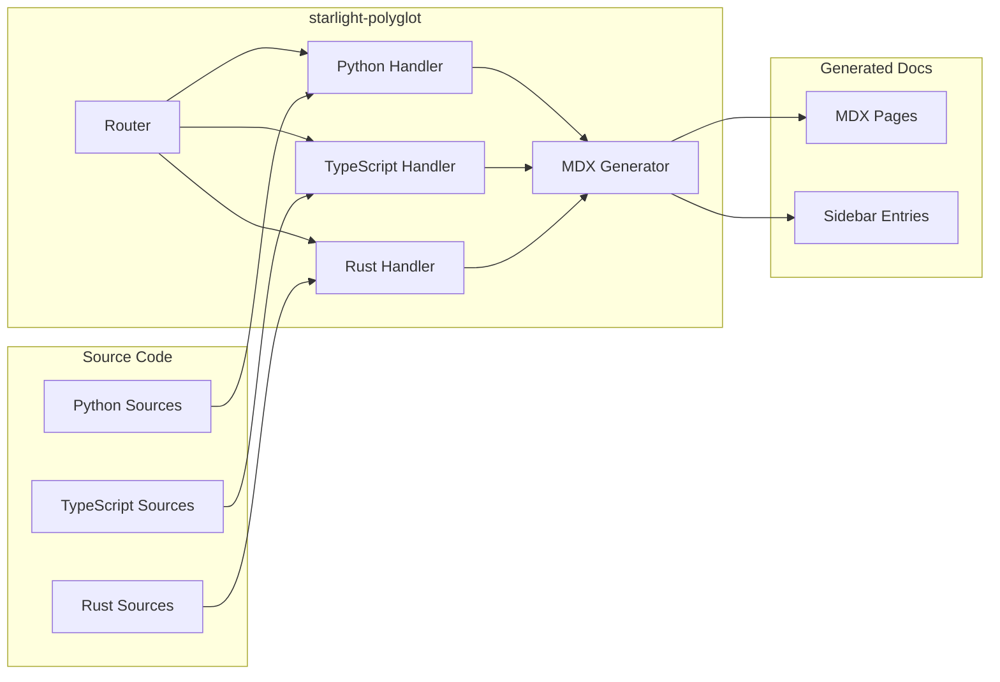

import { Card, CardGrid } from '@astrojs/starlight/components';

starlight-polyglot is a **Starlight plugin** that generates native MDX API documentation pages from source code written in any major programming language. Write code in Python, TypeScript, Rust, R, Julia, C#, or Go — and get beautiful, searchable, sidebar-integrated documentation automatically.

## How It Works

Each language has a dedicated **handler** that uses the language's native documentation toolchain to extract API metadata, then transforms it into Starlight-native MDX files with proper frontmatter, pagefind indexing, and sidebar entries.



## Quick Start

```bash
npm install starlight-polyglot
```

Add the plugin to your `astro.config.mjs`:

```js
import starlight from '@astrojs/starlight';
import polyglot from 'starlight-polyglot';
import { defineConfig } from 'astro/config';

export default defineConfig({
  integrations: [
    starlight({
      title: 'My API Docs',
      plugins: [
        polyglot({
          python: {
            entryPoints: ['src/mylib'],
          },
          typescript: {
            entryPoints: ['src/index.ts'],
            tsconfig: 'tsconfig.json',
          },
        }),
      ],
    }),
  ],
});
```

Run `astro dev` or `astro build` and the plugin generates documentation under `src/content/docs/api/`.

## Supported Languages

| Language     | Status       | Toolchain               | Requires                                  |
|--------------|--------------|-------------------------|-------------------------------------------|
| Python       | ✅ Phase 1   | Griffe                  | Python 3.11+ `pip install griffe`         |
| TypeScript   | ✅ Phase 1   | TypeDoc                 | `npm install typedoc typedoc-plugin-markdown` |
| Rust         | 🚧 In Progress | rustdoc JSON          | Rust nightly `cargo +nightly rustdoc`     |
| R            | 🚧 Planned   | roxygen2 / Rscript      | R runtime + roxygen2                      |
| Julia        | 🚧 Planned   | Documenter.jl / Base.Docs | Julia runtime                           |
| C#           | 🚧 Planned   | .NET XML doc            | .NET SDK                                  |
| Go           | 🚧 Planned   | gomarkdoc               | `go install github.com/princjef/gomarkdoc` |

## Core Architecture

- **Plugin Entry**: Standard Starlight plugin using the `config:setup` hook
- **Router**: Resolves user configuration → handler instances per language
- **Handlers**: Language-specific extractors using native toolchains
- **MDX Generator**: Shared pipeline transforming AST data → Starlight MDX pages
- **Sidebar Integration**: Auto-registers generated pages in the Starlight sidebar

## Features

- 🔧 **Handler-based architecture** — add support for any language
- 📦 **Zero runtime dependencies** — only optional peer deps per handler
- 🔍 **Pagefind search** — all generated pages are searchable out of the box
- 📐 **Consistent frontmatter** — every generated page has title, description, sidebar, language, source metadata
- 📑 **Auto sidebar** — generated pages automatically appear in the Starlight sidebar
- 🐕 **Dogfood** — this documentation site uses starlight-polyglot to document itself

## Project Links

- [GitHub Repository](https://github.com/edithatogo/starlight-polyglot)
- [Issue Tracker](https://github.com/edithatogo/starlight-polyglot/issues)
- [Changelog](https://github.com/edithatogo/starlight-polyglot/blob/main/CHANGELOG.md)
- [npm Package](https://www.npmjs.com/package/starlight-polyglot)
